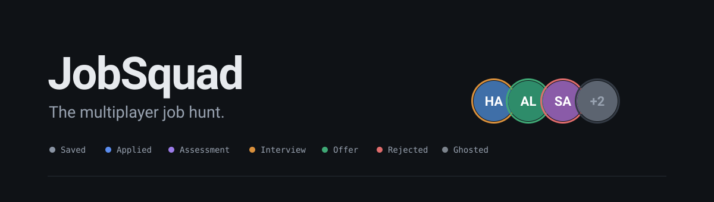
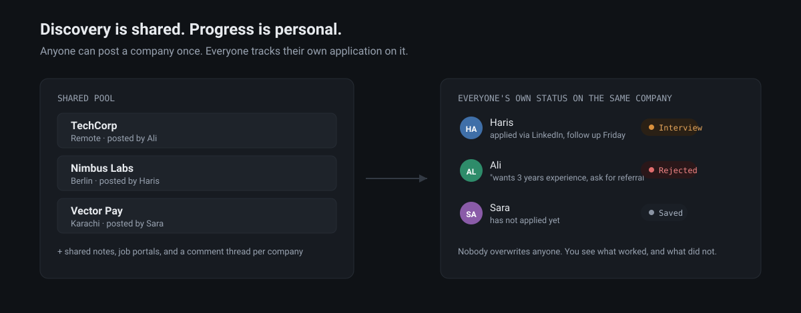
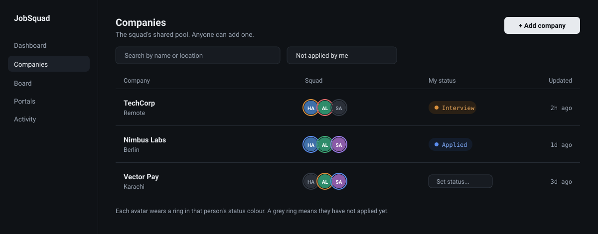
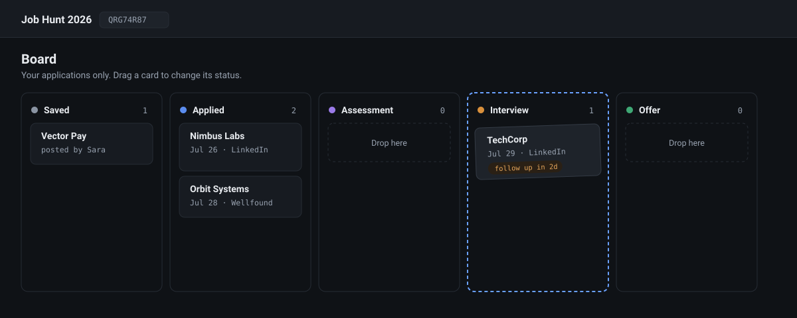

<p align="center">
  
</p>

<p align="center">
  <b>Job hunting is lonely and badly tracked. It should not be either.</b><br>
  A self-hosted tracker where a group of friends hunts together: shared companies, private-to-you-but-visible-to-them progress.
</p>

---

## The problem

Everyone job hunting with friends does the same two things, and both leak.

You share leads in WhatsApp, where a link scrolls out of reach in a day and nobody remembers who already applied. And you track your own applications in a spreadsheet you stop updating by week three, so you cannot answer "did I already apply here?" or "what happened with that one?".

Meanwhile every job tracker on the market (Huntr, Teal, Simplify) is built for exactly one person. None of them know your friend exists.

## The idea

**Discovery is shared. Progress is personal.**

Your squad keeps one common pool of companies and job portals. Anyone posts a company once and everyone sees it. But each member owns their own application on it: their status, their dates, their notes. Nobody overwrites anyone.

<p align="center">
  
</p>

That one structural choice is what makes the group worth having. When Ali gets rejected and writes "they want 3 years minimum, get a referral first", that note is waiting for you *before* you spend an evening on the application. When Sara gets an interview through a portal you gave up on, you can see it.

## What it looks like

Every company row shows your whole squad at a glance. Each avatar wears a ring in that person's status colour for that company, so one look tells you who has applied, who is interviewing, and who has not started.

<p align="center">
  
</p>

Your own pipeline is a board. Drag a card and the status is saved for you alone.

<p align="center">
  
</p>

## What you get

**Track the hunt**
- One application per person per company: status, applied date, follow-up date, the portal you went through, the job posting link, and your notes
- Seven statuses that match reality, including **ghosted**, where most applications actually die
- A board you drag cards across, and follow-up dates that surface what is due this week

**Hunt as a group**
- Shared company pool with website, careers page, location, tags, and facts the whole squad should know
- Shared job portals, each with your own rating and notes, plus a running tally of which portals actually convert ("12 applications, 3 interviews, 1 offer via this one")
- A comment thread on every company
- A live activity feed: "Ali moved TechCorp to Interview" appears for everyone as it happens
- A dashboard with your numbers, a squad comparison, and the list of companies your friends posted that you have not applied to yet

**Own your data**
- CSV export for applications, companies, and portals, any time
- Everything lives in one database file you can copy
- Self-hosted: no account with anyone, no data sold, no seat limits

## Quickstart

You need [Python 3.12+ with uv](https://astral.sh/uv) and [Node.js 18+](https://nodejs.org).

1. **Windows**: double-click `START.bat`. **macOS or Linux**: `python3 run.py`
2. First run installs dependencies and builds the app. Later starts are quick.
3. Your browser opens at `http://localhost:8100`.
4. The console also prints a **Network URL** like `http://192.168.1.23:8100`. Friends on the same Wi-Fi open that. Allow the Windows Firewall prompt if it appears.
5. Create your account, create a group, and share the 8-character **invite code**.

That is the whole setup. No database to install, no services to configure.

## Signing in

JobSquad adapts to where it runs:

- **On your Wi-Fi**, signup is instant: display name, email, password.
- **On the public internet**, turn on bot protection with config alone. Set a [Resend](https://resend.com) API key and signup requires a 6-digit code emailed to a real address. Add OAuth credentials and **Continue with Google / GitHub / LinkedIn** buttons appear automatically.

You never pick a username. The server derives a handle; you choose a display name, or it comes from your provider along with your avatar.

## Deploying it for real

See **[DEPLOY.md](DEPLOY.md)**. The short version: the app is one process, so it deploys anywhere a container runs, and its data belongs in a hosted Postgres so a redeploy cannot wipe it.

## Configuration

Everything is optional. Defaults are chosen so the app runs with zero configuration.

| Variable | Default | What it does |
|---|---|---|
| `JOBSQUAD_PORT` | `8100` | Port for the API and the app |
| `JOBSQUAD_DB_PATH` | `data/jobsquad.db` | Database file |
| `JOBSQUAD_SECRET` | auto | Session signing secret. Generated and saved to `data/.secret` if unset. Set it explicitly on a real server |
| `JOBSQUAD_TOKEN_TTL_HOURS` | `168` | How long a login lasts (7 days) |
| `JOBSQUAD_PUBLIC_URL` | `http://localhost:8100` | Public address, used to build OAuth redirect URLs |
| `JOBSQUAD_DEV` | unset | `1` runs the Vite dev server on 3100 with hot reload |
| `JOBSQUAD_RESEND_API_KEY` | unset | Resend key. **Setting this turns on email verification at signup** |
| `JOBSQUAD_MAIL_FROM` | unset | Sender address, for example `JobSquad <noreply@yourdomain.com>` |
| `JOBSQUAD_SMTP_HOST` and friends | unset | SMTP instead of Resend, if you prefer |
| `JOBSQUAD_GOOGLE_CLIENT_ID` / `_SECRET` | unset | Enables Continue with Google |
| `JOBSQUAD_GITHUB_CLIENT_ID` / `_SECRET` | unset | Enables Continue with GitHub |
| `JOBSQUAD_LINKEDIN_CLIENT_ID` / `_SECRET` | unset | Enables Continue with LinkedIn |

## How it is built

One process serves everything: FastAPI answers the JSON API under `/api/*` and serves the built React app on a single port. Authentication is stdlib-only, with PBKDF2 password hashing and hand-rolled HS256 tokens, so there is no auth library to keep patched. Realtime updates are server-sent events. The interface is dark by default with a light mode, built on one token system where colour is only ever used to carry meaning.

```
JobSquad/
  START.bat     Windows double-click launcher
  run.py        installs, builds, runs, and opens the app
  backend/      FastAPI: the API, auth, and the built frontend
  frontend/     React 18 + Vite + TypeScript + Tailwind
  docs/         README artwork
  data/         created on first run: the database and auth secret
```

Backend tests: `uv run pytest` in `backend/`. Frontend checks: `npm run typecheck` in `frontend/`.

## Security, honestly

Group data is only ever visible to that group's members, and a request for another group's data returns a plain "not found" rather than confirming it exists. Passwords are hashed with PBKDF2 at 250,000 iterations. Login attempts are rate limited. CSV exports neutralise spreadsheet formula injection. Session tokens returned from social sign-in travel in the URL fragment, so they never reach a server log.

The honest caveat: with no email or OAuth configured, anyone who can reach the URL can register. That is fine on your Wi-Fi and wrong on the open internet, which is why verification exists and why turning it on is a single environment variable.

## Roadmap

Not built yet, on purpose: password reset, push and email notifications, removing members or deleting groups, avatar uploads, and multiple squads sharing a company pool.

## License

See [LICENSE](LICENSE).
